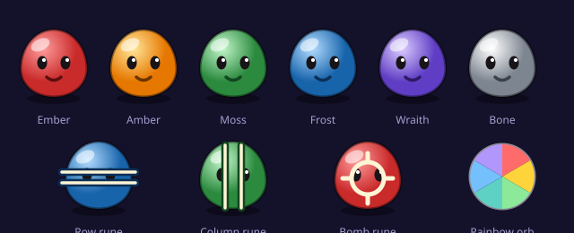

# Rune Fall — Slimes of Midgard

A match-3 puzzle game in the browser. Norse fantasy field, cute slime creatures, rune
power-ups, timed quests and a regenerating pool of lives. No build step, no framework, no
npm install — plain HTML, CSS and JavaScript.



## Run it

Double-click `index.html`. That's the whole setup.

Once you start editing, serve it instead so the browser stops caching your CSS and JS:

```bash
python3 -m http.server 8000
# then open http://localhost:8000
```

To publish, upload the folder anywhere that serves static files — GitHub Pages, Netlify,
Cloudflare Pages, Vercel, or ordinary shared hosting. Nothing to compile.

The optional lives server in `server/` is separate and only needed if you want IP-keyed
lives. See [Lives](#lives) below.

## How to play

Swap two neighbouring slimes by tapping one then the other, or by swiping. Line up three or
more of the same colour and they pop. Bigger matches leave a rune behind:

| Match | Leaves | What it does |
| --- | --- | --- |
| 4 in a row | Row rune | Clears its entire row |
| 4 in a column | Column rune | Clears its entire column |
| 5 in an L or T | Bomb rune | Blasts the surrounding 3×3 |
| 5 in a straight line | Rainbow orb | Swap it with any slime to erase every slime of that colour |

Runes caught in another match set each other off, so chains are worth building. Each quest
asks you to collect a set number of specific slimes before **both** the move budget and the
clock run out. The board reshuffles itself if no valid move is left. There's a hint button,
and an idle nudge fires after eight seconds if you stall.

## Objectives

Quests ask for one of three things, and often a blocker goal alongside it:

| Goal | What it wants | Appears |
| --- | --- | --- |
| Collect | A number of slimes of one to three colours | Most quests |
| Score | A zeny total earned within the quest | Every 5th quest |
| Blockers | Every frost and bramble cleared off the board | Quest 3 onward |

**Frost** sits on a cell and chips away when you clear a match on top of it. **Bramble** locks
its cell — you can't swap that slime until something clears it, so you have to work a match
into it from around the outside. Both belong to the cell rather than the slime, so slimes fall
through them normally and gravity is untouched.

Goal sizes are derived from what a board can actually produce, not picked by hand — see
[Balance](#balance).

## The stage clock

Every quest is timed, and the clock is derived from the quest itself rather than set by hand:
more slimes to collect means more time, but each quest tightens the belt slightly. The bar
turns red at 20% remaining.

Clearing fast pays. Time left is multiplied by a speed tier:

| Time remaining | Tier | Bonus multiplier |
| --- | --- | --- |
| 50% or more | Swift | ×2 |
| 25–50% | Steady | ×1.5 |
| under 25% | Narrow | ×1.15 |

The bonus is `secondsLeft × (18 + questNumber × 4) × multiplier`, so the same speed is worth
progressively more as quests get harder.

**If the clock hits zero, the quest fails and it costs one life.** Running out of moves does
the same, as does pressing "Give up" — all three are failures and all three cost a life. If
you'd rather only the timer cost a life, remove the `failStage` calls from `endOfTurn()` and
the restart button in `js/game.js`.

## Zeny, and buying your way out

Zeny is a wallet, not a run score. It survives failing a quest, because otherwise you could
never save enough to spend it.

When you run out of moves or time, you're offered a continue before a life is taken:
`+5 moves` or `+30 seconds` for zeny. The first costs 1,200, and each further continue in the
same quest doubles. Decline it, or fail to afford it, and you lose a life instead and the
quest restarts. Giving up deliberately always costs a life — no continue offered.

Continues are the reason the score bonus matters. Clearing fast earns the zeny that buys you
out of a bad board later.

## Progress

Your quest number, zeny and carried rune charges are saved as you play, so closing the tab
mid-run loses nothing. Returning shows a "welcome back" screen with the option to continue or
start over from quest 1.

This is stored in `localStorage` via `js/progress.js`, deliberately separate from lives: lives
are a rate limit a player has reason to cheat, so they belong on a server, while progress
exists for the player's benefit and there's nothing to protect.

## Unused moves become rune charges

Finishing a quest early converts what's left of your move budget into carried power-ups.
Every 3 unused moves is one rune charge, minimum one if you had any moves left at all, up to
a ceiling of 5 held at once. Charges carry forward across quests and accumulate.

Spend one by pressing the rune charge button and then tapping any slime on the board: it
becomes a bomb rune, no move consumed. It sits there until you match it, so you choose when
it goes off. Failing a quest forfeits all held charges.

Both ratios are constants at the top of `js/game.js`:

```js
const MOVES_PER_CHARGE = 3;    // unused moves per charge
const MAX_CHARGES      = 5;    // ceiling on charges held
```

A 1:1 conversion is tempting but breaks the game — 20 spare moves would mean 20 free bombs.

## The warp

Clearing a quest plays a transition rather than a dialog box. Tiles spiral out from the
centre in a ring-shaped stagger, a portal opens, and two cards pass through it: your clear
summary — time left, speed bonus, charges earned — then the next quest's objective, showing
what you'll be collecting, the move budget, the clock and any charges you're carrying in.
The new board falls in through the portal on a diagonal stagger.

The whole sequence runs about 4.5 seconds. Timings are the `sleep()` calls in `warp()` in
`js/game.js`; the visuals are the `.warp` rules in `css/styles.css`.

## Lives

Five lives. Losing a quest costs one. A life comes back every 30 minutes, and the timer keeps
running whether or not the page is open, so closing the tab and coming back later works as
you'd expect. Lives are restored one at a time, and multiple lives owed are all credited on
return. At zero lives the board locks and a live countdown to the next life replaces the
board; when one lands, the overlay switches to a button and you're back in.

The countdown also resists a common trick: if the system clock jumps backwards, the wait is
capped at 30 minutes rather than becoming permanent.

### About keying lives to an IP address

You asked for lives tied to the visitor's IP so a refresh can't reset them. Worth being
straight about how far a browser can go here:

**A web page cannot read the visitor's IP address.** There's no browser API for it, by
design. Anything stored client-side is scoped to a browser profile, not a connection. So the
game ships in **local mode**: lives persist in `localStorage`, which survives refreshes,
tab closes and reboots, but not a cleared cache, a private window or a different browser.

For real IP-keyed lives you need a server, so one is included: `server/lives-server.example.js`.
It's plain Node with no dependencies, keeps the pool keyed by IP, and does the regeneration
server-side where a player can't touch it.

```bash
node server/lives-server.example.js
```

Then uncomment this line in `index.html`, above the other script tags:

```html
<script>window.RUNE_LIVES_ENDPOINT = "http://localhost:8787";</script>
```

`js/lives.js` will use the server when that's set and fall back to local storage if the
server is unreachable, so the game never hard-fails on a bad connection.

Four things to know before putting that server on the public internet — all of them are also
written at the top of the file:

1. **State is in a `Map`**, so restarting the server refills everyone. Swap the `store`
   object for Redis, SQLite or Postgres; it's two methods.
2. **Behind a proxy or CDN**, `remoteAddress` is the proxy's IP and every player shares one
   pool. Set `TRUST_PROXY=true` to read `X-Forwarded-For` — but only when a proxy you
   control sets that header, since clients can otherwise forge it.
3. **IP is a blunt key.** Households, offices, schools and most mobile carriers put many
   people behind one address via NAT. In the Philippines, mobile CGNAT means a large number
   of players can look like a single IP and share one pool of 5. If accurate per-player
   lives matter, an account login is the real answer; IP is the approximation.
4. **The `/lives/restore` route refills on demand.** Delete it before deploying.

## Balance

`test/balance.js` plays quests with a bot that reads the board out of the DOM, aims at
blockers, and never uses rune charges — one move deep, no cascade planning. It's deliberately
worse than a competent person, so a goal the bot reaches is one a player reaches comfortably.

```bash
npm run balance          # quests 5, 10 and 15
npm run balance 3 7 12   # specific quests
node test/balance.js --blind 7   # the naive bot, for comparison
```

This harness caught a real bug. The original goal curve asked for 42 slimes of each of three
colours by quest 7 — but with six colours only about one cleared tile in six matches a given
goal, and a move clears roughly 4.5 tiles. The quest was asking for 126 tiles when the board
could yield about 61. **Every quest past the second was mathematically unwinnable**, and no
amount of playtesting the first two levels would have shown it.

Goal sizes now come from that arithmetic: `moves × 0.75` per colour, scaled by a pressure
factor. Difficulty rises through the colour count, the shrinking clock and the blockers rather
than through a number the board can't produce.

| Quest | Colours | Each | Total asked | Board can yield | Blockers |
| --- | --- | --- | --- | --- | --- |
| 1 | 1 | 16 | 16 | 22 | — |
| 5 | 3 | 16 | 48 | 63 | 2 |
| 10 | 3 | 17 | 51 | 58 | 5 |
| 20 | 3 | 15 | 45 | 47 | 8 |

Score targets are derived the same way, at 220 zeny per move of budget against a measured bot
average near 300.

## Testing

`test/smoke.js` boots the real `index.html` in jsdom, clicks Begin, plays a turn via the
hint system, and spends a life. It catches runtime errors that a syntax check can't — a
function called before the data it reads exists, a handler that never gets attached because
an exception killed the script above it.

```bash
npm install     # jsdom, the only dev dependency
npm test        # smoke + features
```

`test/features.js` covers the newer systems in separate browser instances: saved progress
restoring, blockers placing and chipping, bramble cells refusing selection, score quests, the
continue offer and its zeny charge, and the no-zeny path that spends a life instead. It speeds
up `performance.now` to drain a stage clock in seconds so timeouts are testable.

`test/bot.js` is shared by both harnesses.

It serves the folder on a random port during the run, because jsdom refuses `localStorage`
on `file://` origins. Exit code is non-zero if anything fails. Worth running before you
deploy, since a thrown error during boot leaves the Begin button dead with nothing on screen
to explain why.

## Project structure

```
rune-fall/
├── index.html              markup, HUD, overlays, shared SVG gradient defs
├── css/
│   └── styles.css          palette tokens, board, timer, warp, animations
├── js/
│   ├── game.js             board, matching, quests, timer, warp, charges, blockers
│   ├── lives.js            5 lives, 30-minute regen, local or server-backed
│   ├── progress.js         quest number, zeny and charges across sessions
│   └── leaves.js           falling-leaf background, independent of the game
├── server/
│   └── lives-server.example.js    optional IP-keyed lives, plain Node
├── test/
│   ├── smoke.js            headless boot-and-play check
│   ├── features.js         progress, blockers, score quests, continues
│   ├── balance.js          bot playthroughs for tuning goal sizes
│   └── bot.js              shared board reader and move chooser
├── assets/
│   ├── favicon.svg         slime mascot, browser tab icon
│   └── sprite-sheet.svg    reference art for docs and previews
├── package.json
├── README.md
└── .gitignore
```

The radial gradients that colour the slimes live inline in `index.html`, inside a zero-size
`<svg>`. They have to be inline — an SVG `url(#id)` reference can't reach into a separate
file, and fetching one would break when you open the page with `file://`.

`assets/sprite-sheet.svg` is documentation, not a game asset. The game draws its pieces from
`slimeMarkup()` in `js/game.js`. If you retheme, update both.

## Tuning

**Colours and creature names** — the `TYPES` array in `js/game.js`, paired with the
`<radialGradient>` blocks in `index.html`. Array index and gradient id have to line up:
`TYPES[2]` uses `url(#g2)`.

**Board size** — `ROWS` and `COLS` in `js/game.js`. The CSS is driven by a `--cell` variable
that `fit()` recalculates, so an odd board like 7×9 works without touching the stylesheet.

**Difficulty curve** — `questFor(n)` returns the colours, goal sizes, blocker plan and move
budget; `timeFor(q, n)` derives the clock from all of it. Change anything here and re-run
`npm run balance` — the numbers are tied to measured clearing rates, not intuition.

**Continues** — `CONTINUE_BASE`, `CONTINUE_MOVES` and `CONTINUE_SECONDS` at the top of
`js/game.js`. The cost doubles per continue within a quest.

**Blockers** — the `plan` object in `questFor()`. `frostHp` above 1 makes frost take several
matches; balance runs showed 2 made the blocker goal the only thing that mattered, so it's 1.

**Lives and regeneration** — `MAX` and `REGEN_MS` at the top of `js/lives.js`, mirrored in
`server/lives-server.example.js`. Change both or they'll disagree.

**Scoring** — `clear.size * 60 * combo` in `resolve()`, 80 per tile for rainbow detonations,
and the speed bonus in `completeQuest()`.

**Falling leaves** — `js/leaves.js`. `COLORS` sets the palette, `count()` sets density per
viewport width, `spawn()` controls fall speed, sway, spin and opacity. Shares nothing with
the game, so you can delete the file and its `<script>` tag for a bare field.

**Theme palette** — the `:root` block in `css/styles.css`.

## Browser support

Any current browser. Uses pointer events, CSS custom properties, `conic-gradient` and a 2D
canvas. Works on phones — the board scales to the viewport, swipe input is handled, and leaf
density drops on small screens.

`prefers-reduced-motion` is respected throughout: CSS animations collapse to near-instant and
the leaves render as a still scatter with no loop running. The leaf loop and the stage clock
both pause while the tab is in the background, so nobody loses a life to a phone call.

If `localStorage` is blocked — private mode, a sandboxed frame — `js/lives.js` falls back to
in-memory storage rather than throwing. Lives then reset on refresh, which is the graceful
failure rather than a broken game.

## Notes

The slime and rune artwork is original, drawn as inline SVG. The setting is generic Norse
fantasy rather than any particular game's world, so the art and naming are yours to ship.

Sound is generated at runtime with the Web Audio API, so there are no audio files to load.
The `♪` button in the board corner mutes it.

Local mode trusts the player's own clock, so someone determined can edit `localStorage` or
roll their system clock forward to refill lives. This is not fixable client-side — the server
mode exists precisely because regeneration has to run somewhere the player can't reach.

## Ideas not built yet

- Colourblind support: the six slimes differ only by hue, which is a real accessibility gap
- Accounts, so lives follow the player instead of the browser or the connection
- Obstacle tiles (stone blocks, frozen slimes) so later quests differ in kind, not just number
- A quest map screen instead of a straight run of numbered levels
- Hand-authored levels in place of the procedural `questFor()` curve
- Spending zeny on extra moves or a life refill
